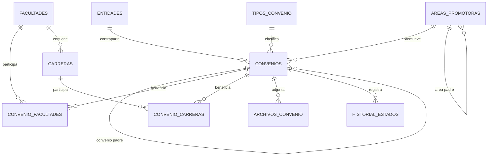
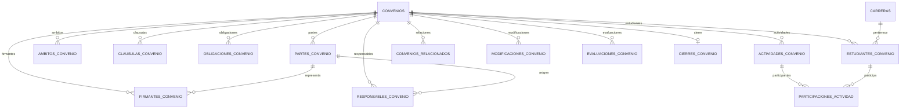
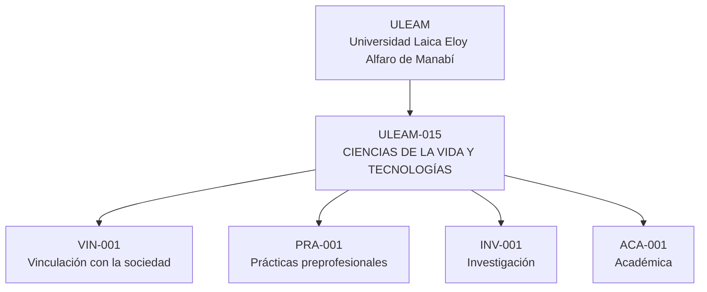

# Entidades y base de datos - Sistema de Convenios FCVT

Este documento resume las entidades principales del sistema, sus relaciones, los catálogos usados como combos y la información relevante de la base de datos.

El sistema usa ASP.NET Core MVC, Entity Framework Core y PostgreSQL. La persistencia principal está configurada en:

- `src/SistemaConvenios.Infrastructure/Persistence/ApplicationDbContext.cs`
- `src/SistemaConvenios.Domain/Entities/`
- `Migrations/`

## Diagrama general de entidades

## Diagrama de gestión contractual

## Tablas principales

| Tabla | Propósito | Campos principales |
|---|---|---|
| `Convenios` | Registro central del convenio. | `Numero`, `TipoConvenioId`, `EntidadId`, `AreaPromotoraId`, `ConvenioPadreId`, `Ambito`, `Objeto`, `FechaInicio`, `FechaVencimiento`, `Estado`, `RenovacionAutomatica` |
| `Entidades` | Empresas, instituciones o contrapartes. | `Nombre`, `TipoEntidad`, `Ruc`, `Provincia`, `Ciudad`, `Pais`, `RepresentanteLegal`, `ContactoGestion*` |
| `TiposConvenio` | Catálogo de tipo de convenio. | `Nombre`, `Descripcion` |
| `AreasPromotoras` | Área, facultad, dirección o unidad que promueve el convenio. Es recursiva. | `Codigo`, `Nombre`, `Tipo`, `AreaPadreId`, `Activo` |
| `Facultades` | Unidades académicas ULEAM. | `Nombre`, `Siglas`, `Activo` |
| `Carreras` | Carreras vinculadas a una unidad académica. | `Nombre`, `Siglas`, `FacultadId`, `Activo` |
| `ConvenioFacultades` | Relación muchos-a-muchos entre convenios y facultades. | `ConvenioId`, `FacultadId` |
| `ConvenioCarreras` | Relación muchos-a-muchos entre convenios y carreras. | `ConvenioId`, `CarreraId` |
| `ArchivosConvenio` | PDFs/documentos adjuntos del convenio. | `NombreOriginal`, `RutaFisica`, `TipoDocumento`, `TamanioBytes`, `FechaSubida` |
| `HistorialEstados` | Bitácora de cambios de estado. | `EstadoAnterior`, `EstadoNuevo`, `Observacion`, `FechaCambio`, `CambiadoPor` |

## Tablas de gestión contractual

| Tabla | Propósito | Campos principales |
|---|---|---|
| `PartesConvenio` | Partes legales del convenio. | `EntidadId`, `Nombre`, `Alias`, `TipoParte`, `Principal`, `Direccion`, `Telefono`, `Email`, `Ruc` |
| `FirmantesConvenio` | Representantes que firman. | `ParteConvenioId`, `Nombre`, `Cargo`, `Identificacion`, `TipoFirma`, `FechaFirma` |
| `ResponsablesConvenio` | Responsables operativos o institucionales. | `ParteConvenioId`, `Nombre`, `Rol`, `Cargo`, `Email`, `Telefono`, `Principal` |
| `AmbitosConvenio` | Ámbitos múltiples del convenio. | `Nombre` |
| `ClausulasConvenio` | Cláusulas del convenio. | `Titulo`, `Tipo`, `Contenido`, `Orden` |
| `ObligacionesConvenio` | Obligaciones por actor. | `Actor`, `Descripcion`, `Orden`, `Estado`, `FechaCumplimiento`, `Evidencia` |
| `ActividadesConvenio` | Actividades ejecutables del convenio. | `Nombre`, `Tipo`, `FechaInicio`, `FechaFin`, `HorasPlanificadas`, `Lugar`, `Responsable` |
| `EstudiantesConvenio` | Estudiantes vinculados a prácticas/actividades. | `CarreraId`, `Identificacion`, `Nombre`, `Email`, `Telefono`, `NumeroPoliza`, `CubiertoSeguro` |
| `ParticipacionesActividad` | Participación de estudiantes en actividades. | `ActividadConvenioId`, `EstudianteConvenioId`, `HorasAsignadas`, `HorasCumplidas`, `Calificacion` |
| `ConveniosRelacionados` | Relación entre convenios. | `ConvenioId`, `ConvenioRelacionadoId`, `TipoRelacion` |
| `ModificacionesConvenio` | Cambios/adendas/modificaciones. | `Tipo`, `Descripcion`, `Motivo`, `Fecha` |
| `EvaluacionesConvenio` | Evaluaciones del convenio. | `Tipo`, `Fecha`, `Calificacion`, `Conclusion`, `Responsable` |
| `CierresConvenio` | Cierre formal del convenio. | `Fecha`, `Causal`, `Resumen`, `ObligacionesPendientes`, `ResponsablesSeguimiento` |

## Combos y catálogos

### Tipo de convenio

Tabla: `TiposConvenio`

| Id | Valor | Uso |
|---:|---|---|
| 1 | Marco | Convenio base general. |
| 2 | Específico | Debe suscribirse a un convenio Marco o Internacional existente. |
| 3 | Internacional | Convenio con instituciones extranjeras. |
| 4 | Otro | Otros tipos de convenio. |

### Estado del convenio

Fuente: `src/SistemaConvenios.Domain/ConvenioEstados.cs`

| Valor | Significado |
|---|---|
| `Vigente` | Convenio activo dentro del periodo. |
| `Por vencer` | Convenio vigente que vence en 30 días o menos. |
| `Terminado` | Convenio finalizado. |
| `Renovado automático` | Convenio vencido con renovación automática. |

### Ámbito

Fuente: `Controllers/ConveniosController.cs`

| Valor |
|---|
| Vinculación |
| Prácticas |
| Académico |
| Investigativo |
| Ayuda/Posgrado |
| Congresos |
| Otro |

### Área que promueve

Tabla: `AreasPromotoras`

Este combo es jerárquico/recursivo por `AreaPadreId`.

Ejemplo de visualización en combo:

| Id | Código | Nombre | Tipo | Padre |
|---:|---|---|---|---|
| 1000 | ULEAM | Universidad Laica Eloy Alfaro de Manabí | Institución | — |
| 1015 | ULEAM-015 | CIENCIAS DE LA VIDA Y TECNOLOGÍAS | Unidad académica | ULEAM |
| 1 | VIN-001 | Vinculación con la sociedad | Área interna | CIENCIAS DE LA VIDA Y TECNOLOGÍAS |
| 2 | PRA-001 | Prácticas preprofesionales | Área interna | CIENCIAS DE LA VIDA Y TECNOLOGÍAS |
| 3 | INV-001 | Investigación | Área interna | CIENCIAS DE LA VIDA Y TECNOLOGÍAS |
| 4 | ACA-001 | Académica | Área interna | CIENCIAS DE LA VIDA Y TECNOLOGÍAS |

### Facultades / unidades académicas

Tabla: `Facultades`

Los datos vienen del archivo Excel de ULEAM y se cargan por seed/migración. Actualmente se incorporaron 39 unidades académicas.

Ejemplos:

| Id | Unidad académica |
|---:|---|
| 1001 | AREAS DE LA SALUD |
| 1005 | CAMPUS FLAVIO ALFARO |
| 1008 | CHONE |
| 1015 | CIENCIAS DE LA VIDA Y TECNOLOGÍAS |
| 1026 | EL CARMEN |
| 1039 | UNIDAD ACADÉMICA DE FORMACIÓN TÉCNICA Y TECNOLÓGICA, EDUCACIÓN VIRTUAL Y OTRAS MODALIDADES DE ESTUDIO |

### Carreras

Tabla: `Carreras`

Las carreras se relacionan con `Facultades` por `FacultadId`. Se cargaron 233 carreras únicas deduplicadas por unidad académica y nombre Senescyt.

Ejemplos visibles para Software:

| Unidad académica | Carrera |
|---|---|
| CAMPUS FLAVIO ALFARO | SOFTWARE |
| CHONE | SOFTWARE |
| CIENCIAS DE LA VIDA Y TECNOLOGÍAS | SOFTWARE |
| EL CARMEN | SOFTWARE |

En las vistas de creación/edición, las carreras se filtran en el navegador usando el atributo `data-facultad-id`, según las facultades seleccionadas.

## Pantallas donde se usan los combos

| Pantalla | Archivo | Combos usados |
|---|---|---|
| Crear convenio | `Views/Convenios/Crear.cshtml` | Tipo, Ámbito, Estado, Entidad, Área promotora, Convenio base, Facultades, Carreras |
| Editar convenio | `Views/Convenios/Editar.cshtml` | Tipo, Ámbito, Estado, Entidad, Área promotora, Convenio base, Facultades, Carreras |
| Listado de convenios | `Views/Convenios/Index.cshtml` | Estado, Tipo, Facultad, Carrera, filtros por empresa/provincia/ciudad/fechas |
| Gestión contractual | `Views/GestionContractual/Index.cshtml` | Carrera para estudiantes, tipos de datos legales y gestión |
| Reportes | `Views/Reportes/Index.cshtml` | Reportes por vencimiento, vigentes y específicos |

## Reglas de negocio importantes

| Regla | Ubicación |
|---|---|
| Un convenio específico debe tener un convenio padre Marco o Internacional. | `ConvenioAppService.ValidarConvenioPadreAsync` |
| Un convenio no puede ser padre de sí mismo. | `Convenio` / `ConvenioAppService` |
| Los representantes de un convenio base pueden heredarse hacia convenios específicos. | `Convenio.CopiarRepresentantesDesde` |
| Estados permitidos: Vigente, Por vencer, Terminado, Renovado automático. | `ConvenioEstados.cs` |
| Si vence y tiene renovación automática, pasa a Renovado automático. | `Convenio.ActualizarEstadoPorFecha` |
| Si vence sin renovación automática, pasa a Terminado. | `Convenio.ActualizarEstadoPorFecha` |
| Si vence en 30 días o menos, pasa a Por vencer. | `Convenio.ActualizarEstadoPorFecha` |
| Solo se permiten archivos PDF en adjuntos. | `ConvenioAppService.SubirArchivoAsync` |

## Relaciones clave

| Relación | Tipo | Descripción |
|---|---|---|
| `Convenios.TipoConvenioId -> TiposConvenio.Id` | N:1 | Cada convenio tiene un tipo. |
| `Convenios.EntidadId -> Entidades.Id` | N:1 | Cada convenio tiene una entidad contraparte. |
| `Convenios.AreaPromotoraId -> AreasPromotoras.Id` | N:1 | Cada convenio pertenece a un área promotora. |
| `Convenios.ConvenioPadreId -> Convenios.Id` | N:1 recursiva | Permite convenios específicos derivados de marco/internacional. |
| `AreasPromotoras.AreaPadreId -> AreasPromotoras.Id` | N:1 recursiva | Permite jerarquía institucional. |
| `Facultades.Id -> Carreras.FacultadId` | 1:N | Una unidad académica contiene varias carreras. |
| `Convenios <-> Facultades` | N:M | Mediante `ConvenioFacultades`. |
| `Convenios <-> Carreras` | N:M | Mediante `ConvenioCarreras`. |
| `ActividadesConvenio <-> EstudiantesConvenio` | N:M | Mediante `ParticipacionesActividad`. |

## Migraciones relacionadas

| Migración | Propósito |
|---|---|
| `20260528203007_InitialCreate` | Estructura inicial de identidad y entidades base. |
| `20260623025431_AgregarFacultadesCarrerasHistorial` | Agrega facultades, carreras e historial. |
| `20260625042127_AmpliarGestionContractual` | Amplía gestión contractual. |
| `20260710144021_AjustesConveniosReportes` | Ajustes de convenios, reportes, estados y filtros. |
| `20260710173524_CatalogosUleamRecursivos` | Agrega catálogos ULEAM, áreas recursivas y combos de facultades/carreras. |

## Resumen de catálogos cargados desde ULEAM

| Catálogo | Tabla | Cantidad aproximada | Fuente |
|---|---|---:|---|
| Unidades académicas | `Facultades` | 39 | Excel ULEAM 2026-1 |
| Áreas/unidades recursivas | `AreasPromotoras` | 40+ | Excel ULEAM + áreas internas FCVT |
| Carreras únicas | `Carreras` | 233 | Excel ULEAM 2026-1, deduplicado por nombre Senescyt |

## Notas de diseño

- `AreasPromotoras` quedó preparada para representar Facultad, Dirección o Área con relación recursiva.
- `Facultades` y `Carreras` se usan como beneficiarias del convenio.
- `AreaPromotoraId` representa quién promueve el convenio.
- `ConvenioPadreId` representa a qué convenio marco/internacional se suscribe un convenio específico.
- Los combos no se administran todavía desde una pantalla CRUD; se cargan por seed/migración.
